<div align="center">
  
</div>

<div align="center">

[](https://github.com/iboshka24)
[](https://github.com/iboshka24?tab=followers)


<a href="https://github.com/iboshka24">
  
</a>

</div>

## whoami

```ts
const iboshka24 = {
  alias: "iboshka24",
  role: "developer",
  city: "Uzbekistan",              // подставим точно, как только скажешь
  os: ["CachyOS", "Arch (by hand)", "Hackintosh · OpenCore", "Windows (for games)"],
  stack: ["TypeScript", "Next.js", "Python", "Rust", "Kotlin", "PostgreSQL"],
  worksWith: ["Hermes Agent", "DeepSeek", "Neovim", "Git"],
  philosophy: "a system is a list of decisions someone made — you can read them",
  building: "Vendra Teach — 35 405 exam questions across 55 sections, 11 900 free",
  favouriteThing: "installing Arch from scratch is my idea of a good evening",
} as const;
```

## What I'm about

I like the layer under the layer — kernels, drivers, installers, packaging — and I
build the tools I miss instead of waiting for someone to make them. Most of what's
here started as *"this should exist, so I'll write it"*.

**Linux, seriously.** My daily machine runs an Arch-based system, and I keep
[ShobikaOs](https://github.com/iboshka24/ShobikaOs) — an Arch-based distribution with
a native Rust/GTK4 installer, automatic hardware driver detection, PipeWire audio,
gaming tweaks and Catppuccin Mocha — building into an ISO on every push. Installing
Arch from nothing, by hand, is still my favourite way to spend an evening.

**Hackintosh, patiently.** Booting macOS on hardware Apple never intended means
reading other people's kexts and ACPI tables until the thing finally comes up. It
broke on me more times than I can count, and it taught me more about drivers than any
course I've taken. What it really taught me is that a system is not magic — it is a
list of decisions someone made, and you can read them.

**Code that has to be right.** Mostly TypeScript and Python, but what I actually enjoy
is the part where the data structure decides whether the feature is even possible.
I would rather spend an evening designing the shape of a record than a week patching
around a bad one.

**Building for people I know.** A lot of students here prepare for exams with
photocopied pages, no answer keys and no feedback. I grew up around that, so the
biggest thing I build is free exam practice for Uzbekistan — with real explanations,
not just a score.

## How I work

- **Local-first, user space.** The whole platform runs without root and without
  Docker: PostgreSQL, Valkey and the API are extracted into my home directory and
  started as normal processes. It means I can run the real stack on a laptop that
  never asked permission from anyone.
- **Tests before claims.** The question bank has a test that recomputes every answer
  from its own prompt, independently of the code that generated it. If the explanation
  and the key disagree, the build fails — I would rather know than ship a wrong answer
  to a student.
- **AI as a colleague, not autocomplete.** I work with **[Hermes Agent](https://hermes-agent.nousresearch.com)**
  (an autonomous agent by Nous Research) driving **[DeepSeek](https://deepseek.com)**
  models: it runs my servers, regenerates the bank, writes and runs the tests, takes
  screenshots of the UI and reports back with evidence. I decide what gets built and
  what gets shipped; the agent does the long mechanical parts, and it is expected to
  verify its own work instead of announcing success.
- **Nothing invented.** Every number in a README of mine is measured: question counts
  come from the generated bank, star counts from GitHub, timings from real runs.

---

## Things I've built

| | |
| --- | --- |
| **[ShobikaOs](https://github.com/iboshka24/ShobikaOs)** | Arch-based Linux distribution: native Rust/GTK4 installer, automatic driver detection, PipeWire, gaming tuning, CI-built ISO. |
| **[exam-figure-svg](https://github.com/iboshka24/exam-figure-svg)** | Draws exam figures — lines, parabolas, scatter plots, tables — from data straight to print-ready SVG. Zero dependencies, and no input can produce `NaN`. |
| **[spaced-repetition-queue](https://github.com/iboshka24/spaced-repetition-queue)** | Answers *"when should this question come back?"* — spaced repetition in ~200 lines, with tests. |
| **Vendra Teach** <sub>(private)</sub> | Exam-prep platform for Uzbek students: **35 000+ questions** across Digital SAT, IELTS, Milliy sertifikat and AP — 55 sections in four interface languages, **11 900 of them free**, scheduled review of mistakes, timed exam mode. |
| **[Staff-utility](https://github.com/iboshka24/Staff-utility)** | Minecraft server utilities for Paper/Folia: `/sus`, `/report`, `/nv`, `/staff`, `gmsp`, `gtp`. |
| **[kod](https://github.com/iboshka24/kod)** | Free SQL trainer that runs a real database in the browser. Tasks are checked by result, not by text. No CDN, no build — SQLite in WebAssembly lives in the repo. |
| **[nutrition-math](https://github.com/iboshka24/nutrition-math)** | Calories and macros from your own body data: Mifflin-St Jeor, a deficit that refuses to go below 1500 kcal, and warnings instead of silent compliance. |
| **[workout-plan](https://github.com/iboshka24/workout-plan)** | A week of training from your days, minutes and equipment — with limits as a real filter: a knee removes lunges, a back removes deadlifts, and each removed move gets a replacement. |
| **[simple-galaxy-simulation](https://github.com/iboshka24/simple-galaxy-simulation-by-ai)** | A galaxy rendered by a few hundred lines of physics, for the fun of watching it hold together. |
| **klyro**, **opencode-studio**, **3d** | Smaller experiments, tools and prototypes. |

Both open packages were extracted from the platform above — they are what I already
run in production, cleaned up enough for someone else to use.

**In design:** a fitness and nutrition companion (calorie goals from your own body
data, meals from a photo, workout plans for calisthenics or dumbbells, plus time
planning) — web app first, Telegram Mini App after.

---

## Stack


TypeScript and Next.js for anything with a screen, Python for anything that thinks,
Rust when the installer has to be small and fast, Kotlin and Java when Minecraft is
involved, PostgreSQL for the data that has to survive.

## Machines


CachyOS with KDE on Wayland is what I actually work on. Arch I install by hand when I
want to remember how the pieces fit. Hackintosh I keep around for the drivers and
because macOS is a good teacher about hardware. Windows only when a game insists.

## Ask me about

Linux installs that went wrong and how I got them back, Hackintosh builds that
shouldn't work but do, designing a question bank that can't lie about its own
answers, and making study material free for students who can't pay for it.

---

<p align="center">
  
  
</p>

<p align="center"><sub>Open to talking about Linux, Hackintosh builds and EdTech for Uzbekistan — and to pull requests in either package above.</sub></p>
